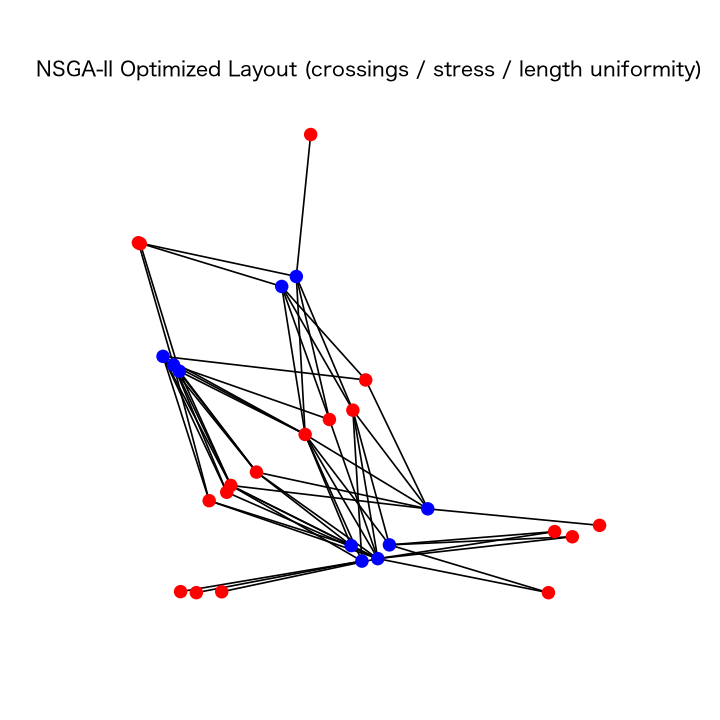
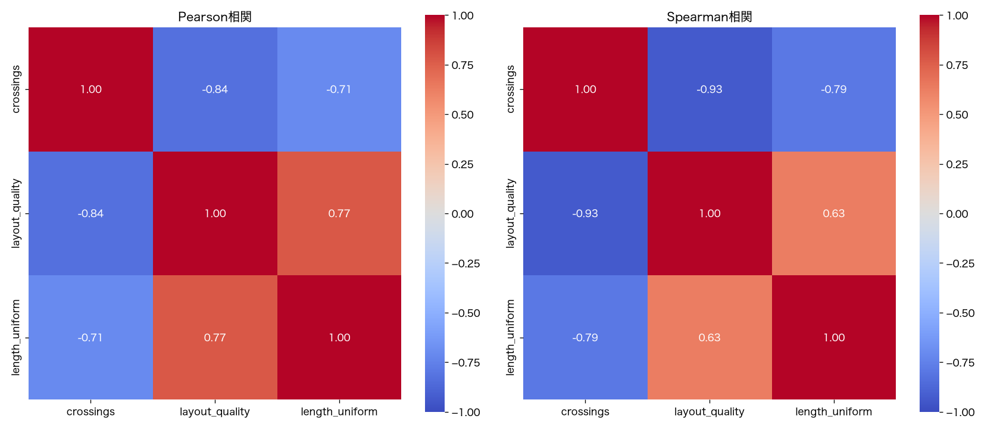
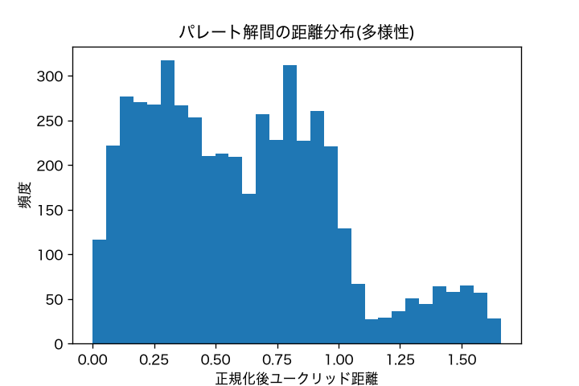
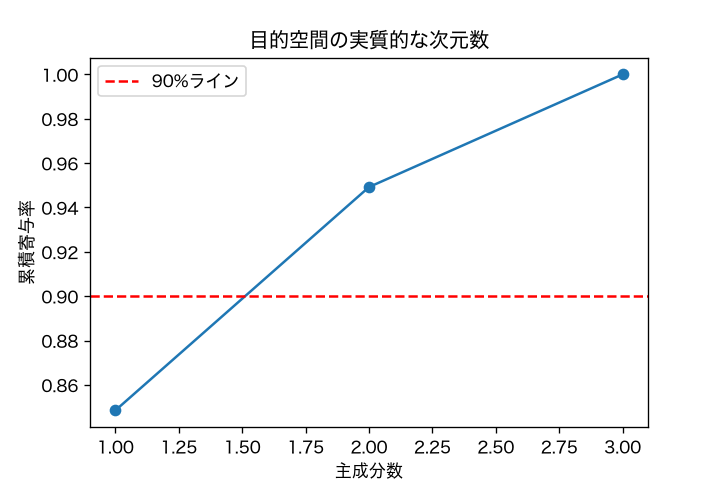

## 多目的最適化による二部グラフのレイアウト最適化

グラフ描画の可読性を評価する複数の指標は互いにトレードオフの関係にある。
多目的最適化によって、二部グラフに対して複数のレイアウト候補(パレート解)を同時に生成する手法の実装。

**本リポジトリの位置づけ**: このプロジェクトで提案する新規の評価指標・目的関数は、
論文投稿準備中のため本リポジトリでは非公開としています。ここでは、その土台となる
実験基盤 ── MovieLensからのサブグラフ抽出、NSGA-IIによる多目的最適化のセットアップ、
比較対象となる標準的な可読性指標(エッジ交差数・ストレス・エッジ長均一性)の実装、
パレート解集合に対する相関・多様性・PCA分析 ── を公開しています。

同じ研究テーマの後続実装として、力学モデル(ストレス多数決法)ベースの
[`bipartite-layout`](https://github.com/YukaYuu/bipartite-layout) を全面公開しています。
設計・検証プロセス(アブレーション実験・単体テスト・CI含む)はそちらで確認できます。

## 結果

実際のMovieLensデータ(サブグラフ抽出後、約20ノード)に対してNSGA-II(pop_size=100, 1000世代)を
実行して得られたパレート最適レイアウトの1つ(3目的の正規化和が最小の解):



得られた100個のパレート解集合に対する分析。エッジ交差数はレイアウト品質・エッジ長均一性と
明確な負の相関(ピアソン-0.84・-0.71)を持ち、これら3指標がトレードオフの関係にあることが
定量的に確認できる:

<p align="center">
  
  
</p>

主成分分析では、第1主成分だけで分散の84.8%を説明する(下図)── 3つの指標は完全に独立ではなく、
本質的には1〜2次元程度の「良いレイアウトほど全指標が同時に改善する」軸が支配的であることを示唆する:



## 内容

- MovieLens データセットからのユーザー・映画二部グラフの構築とサブグラフ抽出
- NSGA-II による多目的最適化のセットアップ(pymoo使用)
- グラフ描画分野で広く使われる標準的な可読性指標
  - エッジ交差数
  - ストレス(理想エッジ長からのズレ)とノードの重なり回避
  - エッジ長の均一性
- 得られたパレート解集合に対する相関分析(ピアソン・スピアマン)、解の多様性(距離分布)分析、主成分分析(PCA)
- (`cpp/`) NSGA-IIの初期集団を、単純な2次元ばねモデルより質の高い出発点にするための、
  3次元力学モデル配置+最適視点探索(C++で高速化)

## ディレクトリ構成

```
.
├── src/bipartite_pareto_layout/
│   ├── config.py       # パス・パラメータ設定
│   ├── data.py          # MovieLens読み込み・サブグラフ抽出
│   ├── geometry.py        # 交差判定・可読性指標(エッジ交差数・レイアウト品質・エッジ長均一性)
│   ├── problem.py           # NSGA-II用のProblem定義(pymoo)
│   ├── plotting.py            # レイアウト描画
│   └── analysis.py              # パレート解集合の相関・多様性・PCA分析
├── scripts/run_optimization.py    # エントリポイント(旧bipartite_layout_optimization.py)
├── cpp/                             # 3次元力学モデル配置+最適視点探索(C++、詳細はcpp/README.md参照)
├── tests/                          # pytest(交差判定・指標計算・Problem評価の単体テスト)
├── .github/workflows/tests.yml      # CI(pytest, Python 3.11/3.12)
├── pyproject.toml
└── README.md
```

## 実行方法

### 1. データセットの準備

[MovieLens ml-1m](https://grouplens.org/datasets/movielens/) をダウンロードし、
`train.txt`(各行が `ユーザーID 映画ID1 映画ID2 ...` の形式のファイル)を
任意のディレクトリに配置

### 2. 環境構築

```bash
pip install -e ".[dev]"
```

### 3. データセットのパス指定

環境変数で指定(既定は `./data/ml-1m`)

```bash
export MOVIELENS_DIR=/path/to/ml-1m
```

### 4. 実行

```bash
python scripts/run_optimization.py
```

`outputs/` ディレクトリに、最適化後のレイアウト画像や、パレート解の相関分析・
多様性分析・PCAの図を出力

### テストの実行

```bash
pytest -v
```

## 参考

- Purchase, H. C. (1997). Which aesthetic has the greatest effect on human understanding?
- MovieLens Dataset: https://grouplens.org/datasets/movielens/
- pymoo (多目的最適化ライブラリ): https://pymoo.org/
